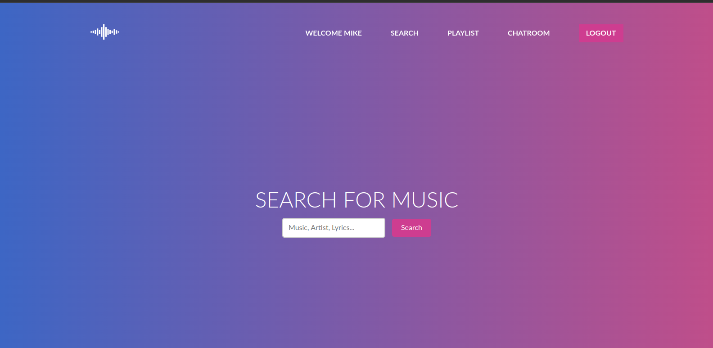
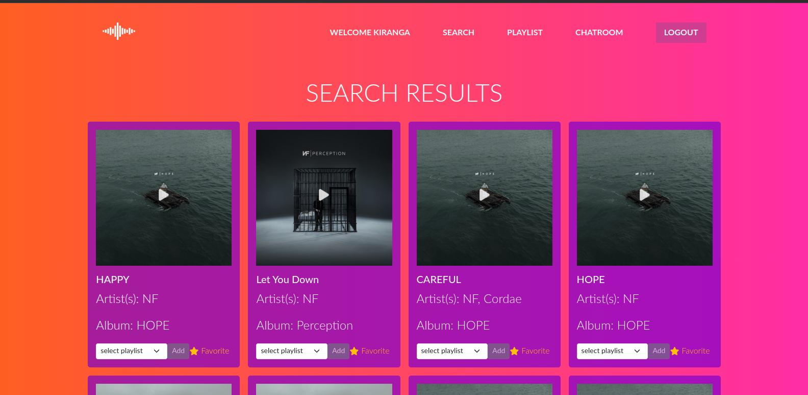
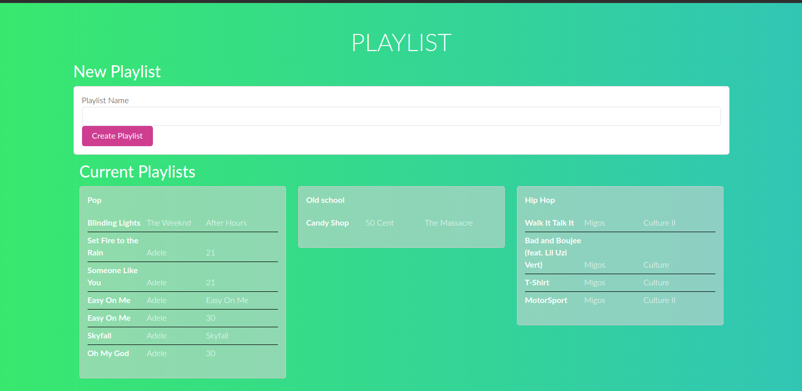
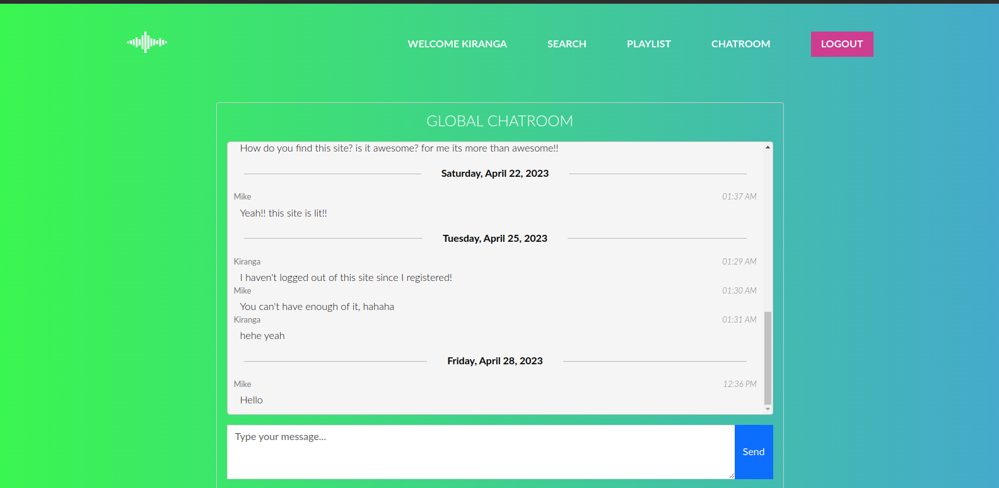

# MusicChat
## Description of the project: 
> MusicChat is a web application that allows users to listen to their favorite music while chatting with other music enthusiasts in real-time. With MusicChat, users can search for and stream their favorite music tracks from Spotify's music catalog, and communicate with others in a chatroom using Firebase Realtime Database. The application is built using Python and Flask, and includes a database for storing user data and music data.

## Learning Objectives:
By working on MusicChat, I aim to develop my skills in Python, Flask, HTML, CSS, and JavaScript, as well as gain experience in integrating with third-party APIs such as Spotify and Firebase services. Additionally, I hope to learn about designing user interfaces, working with databases, and deploying web applications.

## Technologies Used
`Python`, `Flask`, `HTML`, `CSS`, `JavaScript`, `MySQL`, `Spotify API`, `Firebase Realtime database`

## Third-Party Services Used
**APIs and External Services:**
a. **Spotipy/Spotify API:** MusicChat leverages the Spotipy library to interact with the Spotify API, allowing users to search for music and retrieve track information, such as artist, album, and album cover art. The API enables audio playback using Spotify Embeds, which allows users to listen to music directly within the MusicChat platform.

b. **Firebase Realtime Database:** The chatroom functionality in MusicChat is powered by Firebase Realtime Database, which enables real-time updates and communication among users. Firebase synchronizes and stores chat messages, allowing users to experience a live and engaging chat environment.

## Code Execution:
- To run locally, start the virtual environment:  `source musicChat/bin/activate`
- then: `export FLASK_APP=__init__.py` followed by `flask run`

